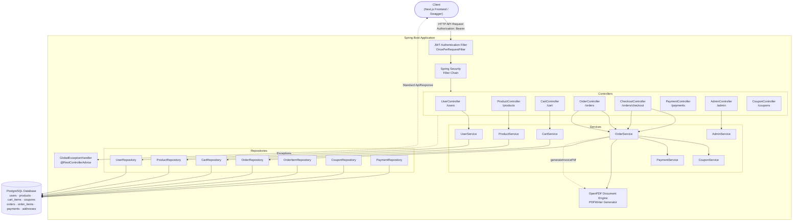

# Smart Commerce — Spring Boot E-Commerce Backend


A production-grade, highly scalable e-commerce REST API platform — built with Spring Boot 3, Spring Security, JWT Authentication, PostgreSQL, and PDF generation capabilities. Paired with a full-featured admin control panel accessible from the frontend.

---

## Table of Contents

- [Overview](#overview)
- [System Architecture](#system-architecture)
- [Features](#features)
- [Tech Stack](#tech-stack)
- [Order Status State Machine](#order-status-state-machine)
- [Database Schema](#database-schema)
- [API Reference](#api-reference)
- [Getting Started](#getting-started)
- [Docker Setup](#docker-setup)
- [Project Structure](#project-structure)

---

## Overview

Smart Commerce is a robust e-commerce backend demonstrating enterprise-grade design patterns:

- **Stateful Transactional Flow**: Fully atomic cart-to-order checkout pipeline using `@Transactional` JPA boundaries.
- **Backend Single Source of Truth**: All financial, coupon, and address calculations are handled purely server-side.
- **Order Status State Machine**: Stock is deducted only on order confirmation and restored on cancellation — never at placement time.
- **Address & Payment Snapshotting**: Guarantees database reference integrity by taking a text-based address snapshot at order placement time.
- **PDF Generation Engine**: Streams high-fidelity binary PDF invoices generated directly by the server.
- **Stateless Authentication**: Endpoints protected via custom Spring Security Filters and stateless JWT tokens.
- **Admin Control Plane**: A dedicated admin API layer enables privileged management of products, users, orders, coupons, and inventory.

---

## System Architecture



---

## Features

### Customer Features
- User registration & login with BCrypt-hashed passwords and JWT session tokens.
- Product browsing with real-time stock-aware availability indicators.
- Shopping cart management (add, update, remove items).
- Coupon application with discount simulation before checkout.
- Secure order placement with shipping address snapshot and payment record.
- Order history and detailed order view.
- PDF invoice download per order.
- Order cancellation (PENDING orders only; confirmed orders require admin action).

### Admin Features
- **Dashboard**: Real-time summary of total users, orders, revenue, and pending order count.
- **Product Management**: Create, update, and delete product listings including image URL, price, and stock quantity.
- **Inventory Management**: View and adjust per-product stock levels.
- **Order Management**: Browse all orders across all users; update order status through the state machine.
- **Coupon Management**: Create discount coupons (percentage or fixed), activate/deactivate, set minimum order amounts and usage limits.
- **User Management**: View all registered users.
- **Analytics**: Revenue and order trends overview.

---

## Tech Stack

| Layer | Technology |
|---|---|
| Framework | Spring Boot 3.5.14 |
| Language | Java 21 (OpenJDK) |
| Security | Spring Security 6, JWT (jjwt 0.12.6), BCrypt |
| Persistence | Spring Data JPA + Hibernate ORM |
| Database | PostgreSQL 16 |
| PDF Generation | OpenPDF 2.0.3 |
| API Docs | SpringDoc OpenAPI 3 (Swagger UI) |
| Build Tool | Apache Maven |
| Containerisation | Docker + Docker Compose |

---

## Order Status State Machine

Stock quantity is managed through a strict state machine — **stock is never deducted at checkout time**. This prevents phantom stock reductions on abandoned or unpaid orders.

```
PENDING ──► CONFIRMED ──► SHIPPED ──► DELIVERED
   │              │
   └──────────────┴──► CANCELLED
```

| Transition | Stock Effect |
|---|---|
| Place order (PENDING) | No stock change |
| PENDING → CONFIRMED | Stock **deducted** per order item |
| CONFIRMED → CANCELLED | Stock **restored** per order item |
| PENDING → CANCELLED | No stock change (stock was never held) |
| CONFIRMED → SHIPPED / DELIVERED | No additional stock change |

Stock deduction on confirmation also validates sufficient quantity and throws `InsufficientStockException` if any product can no longer fulfil the order.

---

## Database Schema

### Orders Table (Entity Snapshotting)

The `orders` table permanently captures financial and shipping configurations to insulate history from future address or user changes:

```sql
CREATE TABLE orders (
    id                BIGSERIAL PRIMARY KEY,
    user_id           BIGINT NOT NULL REFERENCES users(id),
    order_date        TIMESTAMP,
    status            VARCHAR(50),
    subtotal          DOUBLE PRECISION NOT NULL,
    discount_amount   DOUBLE PRECISION DEFAULT 0.0,
    coupon_code       VARCHAR(255),
    total_amount      DOUBLE PRECISION NOT NULL,
    shipping_name     VARCHAR(255),
    shipping_phone    VARCHAR(50),
    shipping_address  VARCHAR(1000)
);
```

### Coupons Table

```sql
CREATE TABLE coupons (
    id                BIGSERIAL PRIMARY KEY,
    code              VARCHAR(100) UNIQUE NOT NULL,
    discount_type     VARCHAR(50),       -- PERCENTAGE | FIXED
    discount_value    DOUBLE PRECISION,
    min_order_amount  DOUBLE PRECISION DEFAULT 0.0,
    max_uses          INT,
    current_uses      INT DEFAULT 0,
    active            BOOLEAN DEFAULT TRUE,
    expiry_date       TIMESTAMP
);
```

---

## API Reference

All protected endpoints require:
```
Authorization: Bearer <token>
```

### Auth & User Module
| Method | Endpoint | Description |
|---|---|---|
| POST | `/users/register` | Register a new user (BCrypt hashed password) |
| POST | `/users/login` | Sign in and receive a signed JWT token |
| GET | `/users` | Retrieve all registered users |

### Products
| Method | Endpoint | Description |
|---|---|---|
| GET | `/products` | List all products (includes stock quantity) |
| GET | `/products/{id}` | Get product by ID |
| POST | `/products` | Create a new product *(admin only)* |
| PUT | `/products/{id}` | Update product *(admin only)* |
| DELETE | `/products/{id}` | Delete product *(admin only)* |

### Cart
| Method | Endpoint | Description |
|---|---|---|
| GET | `/cart` | Fetch current user's cart |
| POST | `/cart/add` | Add item to cart |
| PUT | `/cart/update` | Update item quantity |
| DELETE | `/cart/remove/{productId}` | Remove item from cart |

### Checkout & Payments
| Method | Endpoint | Description |
|---|---|---|
| POST | `/orders/checkout` | Initiates order generation, cart clearance, and payment creation |
| GET | `/payments/order/{orderId}` | Fetch payment status for an order |
| POST | `/payments/success/{paymentId}` | Simulate successful transaction |

### Orders & Invoices
| Method | Endpoint | Description |
|---|---|---|
| GET | `/orders/user/{userId}` | Fetch order history for a user |
| GET | `/orders/{orderId}` | Fetch order details by ID |
| GET | `/orders/{orderId}/invoice` | Download invoice PDF (`application/pdf`) |
| PATCH | `/orders/{orderId}/cancel` | Cancel an order |
| PATCH | `/orders/{orderId}/status` | Update order status *(admin only)* |

### Coupons
| Method | Endpoint | Description |
|---|---|---|
| GET | `/coupons` | List all coupons *(admin only)* |
| POST | `/coupons` | Create a new coupon *(admin only)* |
| POST | `/coupons/apply` | Validate and apply a coupon code |
| PUT | `/coupons/{id}` | Update coupon *(admin only)* |
| DELETE | `/coupons/{id}` | Delete coupon *(admin only)* |

### Admin
| Method | Endpoint | Description |
|---|---|---|
| GET | `/admin/dashboard` | Summary statistics (users, orders, revenue, pending) |
| GET | `/admin/orders` | All orders across all users |
| GET | `/admin/users` | All registered users |

---

## Getting Started

### Prerequisites
- Java 21 (OpenJDK)
- PostgreSQL 16
- Maven 3.9+

### Local Setup

1. Create the database:
   ```bash
   psql -U postgres -c "CREATE DATABASE smart_commerce;"
   ```

2. Configure environment variables (or update `application.properties`):
   ```
   DB_URL=jdbc:postgresql://localhost:5432/smart_commerce
   DB_USERNAME=postgres
   DB_PASSWORD=your_password
   JWT_SECRET=your_jwt_secret_key
   ```

3. Run the application:
   ```bash
   ./mvnw spring-boot:run
   ```

4. Access the Swagger UI at:
   ```
   http://localhost:8080/swagger-ui/index.html
   ```

---

## Docker Setup

A `docker-compose.yml` is included to spin up the application along with a PostgreSQL instance:

```bash
docker-compose up --build
```

This starts:
- **PostgreSQL** on port `5432`
- **Spring Boot API** on port `8080`

Environment variables can be configured via a `.env` file (see `.env.example`).

---

## Project Structure

```
src/main/java/com/ansh/smart_commerce/
├── config/          # Security Configurations & Swagger Setup
├── controller/      # REST Controllers (Endpoint mappings)
├── dto/             # Request and Response Data Transfer Objects
├── entity/          # JPA Database Entities (Order, Product, Coupon, etc.)
├── enums/           # Status Enums (OrderStatus, PaymentStatus, DiscountType, etc.)
├── exception/       # REST Global Exception Handling
├── repository/      # Spring Data JPA Repositories
├── security/        # JWT Token Processing and Filters
└── service/         # Core Business Services (Order, Coupon, Admin, etc.)
```
