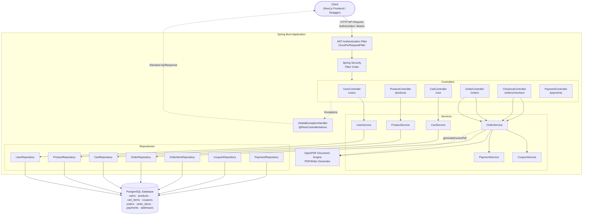

# Smart Commerce — Spring Boot E-Commerce Backend


A production-grade, highly scalable e-commerce REST API platform — built with Spring Boot 3, Spring Security, JWT Authentication, PostgreSQL, and PDF generation capabilities.

---

## Table of Contents

- [Overview](#overview)
- [System Architecture](#system-architecture)
- [New Features implemented](#new-features-implemented)
- [Tech Stack](#tech-stack)
- [Database Schema (Order Entity Snapshotting)](#database-schema-order-entity-snapshotting)
- [API Reference](#api-reference)
- [Getting Started](#getting-started)
- [Project Structure](#project-structure)

---

## Overview

Smart Commerce is a robust e-commerce backend demonstration showcasing enterprise design patterns:

- **Stateful Transactional Flow**: Fully atomic cart-to-order checkout pipeline using `@Transactional` JPA boundaries.
- **Backend Single Source of Truth**: All financial, coupon, and address calculations are handled purely by the server.
- **Address & Payment Snapshotting**: Guarantees database reference integrity when shipping addresses are modified or deleted by taking a text-based address snapshot at order placement time.
- **PDF Generation Engine**: Streams high-fidelity binary PDF invoices generated directly by the server.
- **Stateless Authentication**: Endpoints protected via Custom Spring Security Filters and stateless JWT tokens.

---

## System Architecture



---

## New Features Implemented

1. **Complete Coupon Persistence**:
   - Stores the detailed billing components (`subtotal`, `discountAmount`, `couponCode`, `totalAmount`) directly on the `Order` record.
   - Integrated `CouponService` validation directly inside the order generation pipeline.
   - Synchronized the `Payment` amount to guarantee that the transaction value matches the final discounted order cost.
2. **Simplified Address Snapshotting**:
   - Added support to store historical `shippingName`, `shippingPhone`, and a formatted `shippingAddress` snapshot directly inside the `orders` table. This prevents order record corruption or foreign-key cascade failures if users alter or delete address list records.
3. **OpenPDF Invoice Streaming**:
   - Added a server-side PDF compiler engine using OpenPDF (`com.github.librepdf:openpdf`).
   - Created a clean endpoint at `GET /orders/{orderId}/invoice` returning the binary stream with content type `application/pdf`.

---

## Tech Stack

- **Framework**: Spring Boot 3.5.14
- **Language**: Java 21 (OpenJDK)
- **Security**: Spring Security 6, JWT (io.jsonwebtoken 0.12.6), BCrypt
- **Persistence**: Spring Data JPA + Hibernate
- **Database**: PostgreSQL 16
- **PDF Generation**: OpenPDF 2.0.3
- **Documentation**: SpringDoc OpenAPI 3 (Swagger UI)
- **Build Tool**: Maven

---

## Database Schema (Order Entity Snapshotting)

The `orders` table permanently captures financial and shipping configurations to insulate history from future address/user adjustments:

```sql
CREATE TABLE orders (
    id BIGSERIAL PRIMARY KEY,
    user_id BIGINT NOT NULL REFERENCES users(id),
    order_date TIMESTAMP,
    status VARCHAR(50),
    subtotal DOUBLE PRECISION NOT NULL,
    discount_amount DOUBLE PRECISION DEFAULT 0.0,
    coupon_code VARCHAR(255),
    total_amount DOUBLE PRECISION NOT NULL,
    shipping_name VARCHAR(255),
    shipping_phone VARCHAR(50),
    shipping_address VARCHAR(1000)
);
```

---

## API Reference

All protected endpoints require the header:
```
Authorization: Bearer <token>
```

### Auth & User Module
- `POST /users/register` — Register a user (BCrypt hashing).
- `POST /users/login` — Sign in and receive a signed JWT token.
- `GET /users` — Retrieve all users.

### Checkout & Payments
- `POST /orders/checkout` — Initiates secure order generation, cart clearance, and payment instantiation.
- `GET /payments/order/{orderId}` — Fetch payment status for an order.
- `POST /payments/success/{paymentId}` — Simulate a successful transaction.

### Orders & Invoices
- `GET /orders/user/{userId}` — Fetch order history.
- `GET /orders/{orderId}` — Fetch order details by ID.
- `GET /orders/{orderId}/invoice` — Download invoice PDF (`application/pdf`).
- `PATCH /orders/{orderId}/cancel` — Cancel pending order.

---

## Getting Started

### Local Setup
1. Verify Java 21, PostgreSQL 16, and Maven are installed.
2. Initialize database:
   ```bash
   psql -U postgres -c "CREATE DATABASE smart_commerce;"
   ```
3. Boot the application:
   ```bash
   ./mvnw spring-boot:run
   ```
4. Access Swagger API playground at: `http://localhost:8080/swagger-ui/index.html`

---

## Project Structure

```
src/main/java/com/ansh/smart_commerce/
├── config/                  # Security Configurations & Swagger Setup
├── controller/              # REST Controllers (Endpoints mappings)
├── dto/                     # Request and Response Data Transfer Objects
├── entity/                  # JPA Database Entities (Order, Product, etc.)
├── enums/                   # Status Enums (OrderStatus, PaymentStatus, etc.)
├── exception/               # REST Global Exception Handling
├── repository/              # Spring Data JPA Repositories
├── security/                # JWT Token Processing and Filters
└── service/                 # Core Business Services (Order, Coupon, etc.)
```
